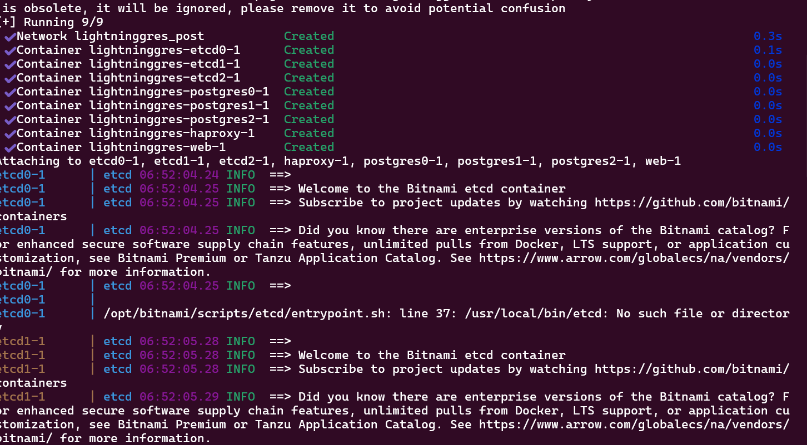

# LIGHTNING_GRES

- PATENTED: Postgres cluster with unique config of pgbouncer, patroni, haproxy (load balancing), and streaming replication, which handled 800 Mbps of json document throughput using a load generation tool called wrk.

